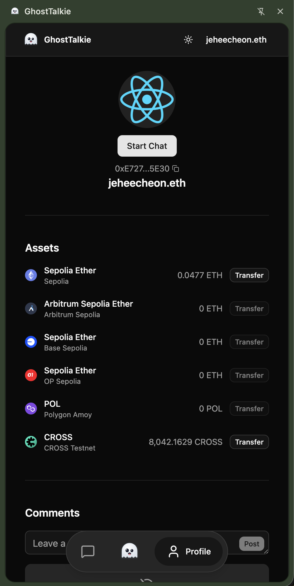
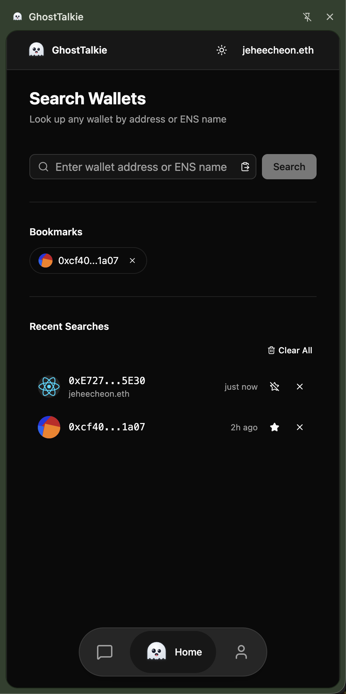
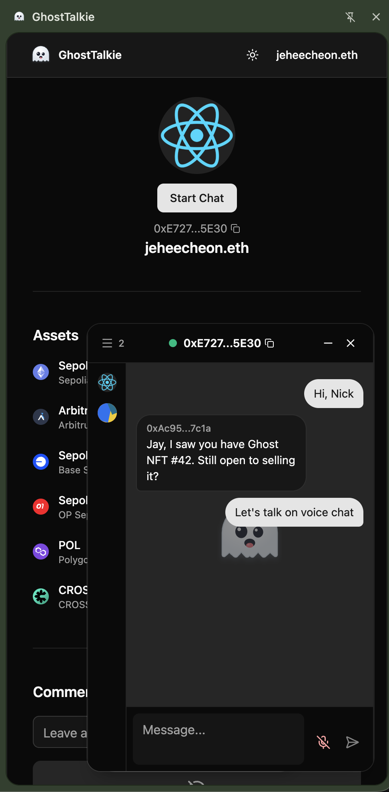

# GhostTalkie

Serverless P2P chat where your Ethereum wallet is your identity. No backend, no database, no accounts — just WebRTC for direct peer connections, Nostr relays (decentralized public message brokers) for connection setup, and cryptographic signatures for identity.

**[Live Demo](https://jeheecheon.github.io/ghost-talkie)** · Chrome Extension (Coming Soon)

<p align="center">
  
  &nbsp;&nbsp;&nbsp;&nbsp;
  
  &nbsp;&nbsp;&nbsp;&nbsp;
  
</p>

---

## Features

- **No signup required** — Connect your Ethereum wallet and start chatting. Your wallet address is your identity.
- **Encrypted P2P chat** — Text and voice messages flow directly between peers via WebRTC. Nothing is stored on any server.
- **Verified identity** — Each participant signs a cryptographic proof with their wallet. Impersonation is impossible.
- **Profile comments** — Leave messages on any wallet profile, even when the owner is offline. Stored on decentralized Nostr relays.
- **Multi-chain support** — View native token balances across Ethereum, Arbitrum, Base, Optimism, Polygon, and CROSS networks.
- **Token transfer** — Send native tokens directly from a wallet profile page with automatic chain switching.
- **Chrome extension** — Chat button appears next to wallet addresses on OpenSea, Blur, and CrossNFT. Chat without leaving the marketplace.
- **Zero cost** — No backend, no database, no paid services. Runs entirely on public infrastructure (GitHub Pages, Nostr relays, STUN servers).

---

## Motivation

Most chat apps require signup, servers, and infrastructure. GhostTalkie explores a different model: **what if real-time communication could work at zero infrastructure cost with stronger identity guarantees than email/password?**

By using wallet signatures as identity proof and public Nostr relays for signaling, there is no server to operate, no database to maintain, and no auth system to build. The total running cost is $0 at any scale.

---

## How It Works

A user opens an NFT marketplace (OpenSea, Blur, etc.), sees a wallet address, and clicks the "Chat Anonymously" button injected by the extension. A side panel opens with the full chat interface. Both users sign a short identity proof with their wallet, the signatures are exchanged and verified over an encrypted WebRTC connection, and a direct peer-to-peer chat session begins — no server involved.

If the other party is offline, the visitor can leave a comment on their wallet profile. Comments are stored on public Nostr relays (decentralized message boards), not on any server we control.

---

## Identity Verification

Each chat room is tied to an Ethereum wallet address. The person whose address it is is the **room host**; anyone who initiates a chat is a **visitor**.

```
Room Host                                      Visitor
  │                                               │
  ├─ Connect wallet                               │
  ├─ Open chat room on /{address}                 │
  │   └─ Sign identity proof with wallet          │
  │       ("I am the host of this room")          │
  │                                               ├─ Visit /{hostAddress}
  │                                               ├─ Connect wallet
  │                                               ├─ Click "Chat"
  │                                               │   └─ Sign identity proof with wallet
  │                                               │       ("I am a visitor to this room")
  │◄──────── WebRTC connection established ──────►│
  │◄──────── Exchange & verify proofs ───────────►│
  │                                               │
  ├─ See visitor's verified address               ├─ Waiting for approval
  ├─ Accept or Reject                             │
  │                                               │
  │◄════════ Encrypted P2P chat (text/voice) ════►│
```

Each peer signs a role-specific message with their wallet private key. The signed message is exchanged over WebRTC and verified against the claimed wallet address across all supported chains. Invalid signatures immediately terminate the connection — impersonation is impossible without the private key.

### Comment Identity (Nostr Two-Signature Scheme)

When a user posts a profile comment, their wallet signs twice:

1. **Seed signature** (private) — Used to deterministically generate a pseudonymous identity (a Nostr keypair). This signature is never shared with anyone.
2. **Ownership proof** (public) — Proves that a specific Ethereum wallet created this pseudonymous identity. This signature is attached to the comment as a verifiable link.

The result: the same wallet always produces the same comment identity, comments are verifiably linked to an on-chain address, and the wallet's signing key is never directly exposed.

---

## Browser Extension

The Chrome extension is the primary interface. It detects wallet addresses on NFT marketplace pages (OpenSea, Blur, CrossNFT) and injects a "Chat Anonymously" button next to each one. Clicking the button opens Chrome's side panel with the full chat experience — without leaving the marketplace.

### Extension Architecture

```
┌─ Marketplace Page (opensea.io) ──────────────────────────────────────┐
│                                                                      │
│  Content Script (MAIN world)           Content Script (ISOLATED)     │
│  ┌──────────────────────────┐         ┌────────────────────────────┐ │
│  │ Browser Wallet Detector  │◄─ msg ─►│ Message Relay              │ │
│  │ (EIP-6963 standard)      │         │ (bridges security worlds)  │ │
│  └──────────────────────────┘         └────────────┬───────────────┘ │
│                                                    │                 │
│  Injector Script                                   │                 │
│  ┌──────────────────────────┐                      │                 │
│  │ "Chat Anonymously" btn   │                      │                 │
│  │ (Shadow DOM isolated)    │                      │                 │
│  └──────────┬───────────────┘                      │                 │
└─────────────┼──────────────────────────────────────┼─────────────────┘
              │ click                     chrome.runtime.sendMessage
              ▼                                      ▼
     ┌──────────────────────────────────────────────────────┐
     │              Background Service Worker               │
     │  ┌────────────────────┐  ┌─────────────────────────┐ │
     │  │ Navigation Manager │  │ Wallet RPC Relay        │ │
     │  │ (opens side panel) │  │ (tab ↔ sidepanel bridge)│ │
     │  └────────┬───────────┘  └─────────────────────────┘ │
     └───────────┼──────────────────────────────────────────┘
                 │ chrome.sidePanel.open()
                 ▼
     ┌──────────────────────────────────┐
     │     Side Panel (React App)       │
     │  ┌────────┬─────────┬──────────┐ │
     │  │  Home  │  Chat   │ Profile  │ │
     │  └────────┴─────────┴──────────┘ │
     │  Wallet connection proxy         │
     │  → wagmi connector               │
     │  → Trystero P2P rooms            │
     │  → Nostr comment client          │
     └──────────────────────────────────┘
```

### Key Design Decisions

**Wallet Bridge Across Security Worlds** — Chrome extensions run content scripts in two isolated environments (MAIN and ISOLATED worlds) that cannot share JavaScript objects. The extension needs access to the host page's wallet (MetaMask, etc.), but the wallet provider lives in the MAIN world while extension messaging only works in the ISOLATED world. A three-layer relay system solves this:

1. **MAIN world** script detects browser wallets using the EIP-6963 standard (a wallet discovery API)
2. **ISOLATED world** script relays messages between the MAIN world and the background
3. **Background service worker** bridges the wallet connection to the side panel

This allows wallet operations (signing, chain switching) from within the side panel without requiring a separate wallet connection.

**Shadow DOM for Button Injection** — Chat buttons are injected inside Shadow DOM to prevent style interference from marketplace page CSS. A MutationObserver watches for dynamically loaded content to inject buttons on newly rendered elements.

**Side Panel API over Popup** — Chrome's Side Panel provides a persistent UI that survives page navigation, unlike popups that close on any click outside. Essential for maintaining chat sessions while browsing.

---

## Technical Decisions

| Decision                              | Options Considered                                                       | Why Chosen                                                                                                   | Tradeoff                                                         |
| ------------------------------------- | ------------------------------------------------------------------------ | ------------------------------------------------------------------------------------------------------------ | ---------------------------------------------------------------- |
| **Nostr relays for WebRTC signaling** | Custom WebSocket server, Firebase, Nostr relays                          | Zero-config, zero-cost, censorship-resistant. 8KB bundle via Trystero                                        | Higher signaling latency (~500ms vs ~100ms for dedicated server) |
| **Wallet signatures for identity**    | Email/password, OAuth, wallet signatures                                 | Eliminates entire auth backend. Cryptographic proof is unforgeable                                           | Requires users to have an Ethereum wallet                        |
| **Nostr protocol for comments**       | Firebase Realtime DB, Supabase, custom API                               | Free public infrastructure with no account required. Retention handled by relay operators                    | Data persistence depends on relay policies (days to months)      |
| **Monorepo with domain package**      | Single app, separate repos, monorepo                                     | P2P and Nostr logic is pure TypeScript (no React). Reusable across web app and extension without duplication | Initial setup complexity                                         |
| **Zustand over Context API**          | React Context, Redux, Zustand                                            | Minimal boilerplate, built-in localStorage persistence, no provider nesting for cross-component chat state   | External dependency for state management                         |
| **Manifest V3 with WXT**              | Raw Manifest V3, Plasmo (extension framework), WXT (extension framework) | File-based entrypoints, HMR, auto-generates manifest from code. Closest to native Chrome extension DX        | WXT is less mature than Plasmo ecosystem                         |

---

## Architecture

```
ghosttalkie/
├── apps/
│   ├── web/                  # React Router v7 SPA (main web app)
│   └── extension/            # Chrome extension (WXT + React)
├── packages/
│   ├── domain/               # Core business logic (no React dependency)
│   │   ├── p2p/              #   WebRTC chat rooms, identity proof exchange
│   │   ├── nostr/            #   Nostr client, comment identity derivation
│   │   └── wallet/           #   Chain config, signature utilities
│   ├── ui/                   # Shared React components and hooks
│   ├── lib/                  # Pure utilities (cn, assert, ensure)
│   ├── types/                # Shared TypeScript types
│   ├── eslint-config/        # Shared ESLint presets
│   └── tsconfig/             # Shared TypeScript configurations
└── turbo.json
```

**Dependency Direction** — Imports flow strictly downward: `types` → `lib` → `domain` → `ui` → `apps`. The `domain` package has zero React dependency, making P2P and Nostr logic testable and reusable in any JavaScript runtime.

---

## Security

| Threat                   | Mitigation                                                                                               |
| ------------------------ | -------------------------------------------------------------------------------------------------------- |
| Room impersonation       | Wallet signature verification on every peer connect. Cannot forge without the private key                |
| Comment identity forgery | Two-layer signing: Nostr event signature + wallet ownership proof. Seed signature never published        |
| Man-in-the-middle        | WebRTC built-in encryption (DTLS) + wallet signature verification on both endpoints                      |
| XSS in chat messages     | Messages rendered as plain text nodes, never as HTML                                                     |
| Extension style leakage  | Chat buttons isolated via Shadow DOM on marketplace pages                                                |
| Host page wallet theft   | Content scripts cannot access extension storage. Wallet proxy only relays explicitly requested RPC calls |

---

## License

MIT
